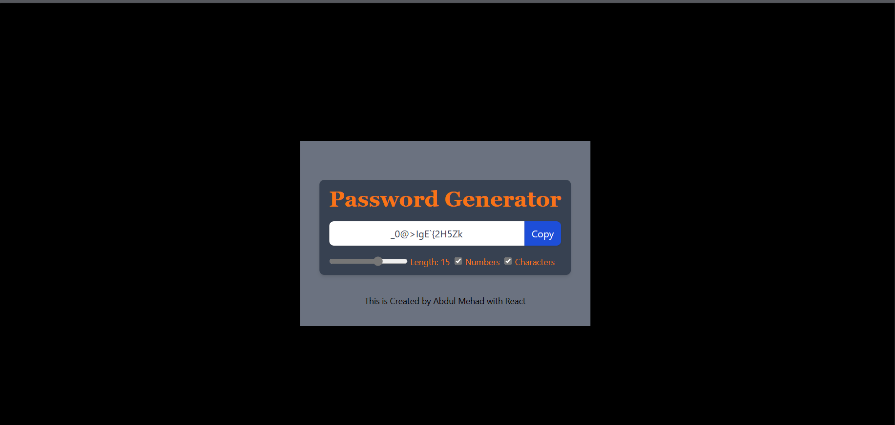

# Password Generator in React


This repository contains a password generator application built using React and Vite. It provides a minimal setup to get React working with hot module replacement (HMR) and includes some ESLint rules.
## Live At
1. To see the Live demo of app, follow this Link

   ```shell[
   https://passwordgeneratorrrrrr.netlify.app/
   ```
   This project can also be seen live at [Live Link](https://passwordgeneratorrrrrr.netlify.app/).

## Installation

1. Clone the repository:

   ```shell
   git clone https://github.com/Abdulmehad/PasswordGeneartorinReact.git
   ```

2. Navigate to the project directory:

   ```shell
   cd PasswordGeneartorinReact
   ```

3. Install the dependencies:

   ```shell
   npm install
   ```

## Usage

1. Start the development server:

   ```shell
   npm run dev
   ```

   This will start the application on a local development server.

2. Open your web browser and visit `http://localhost:3000` to access the password generator application.

## Features

- Generates secure passwords with customizable options.
- Allows users to specify the length of the password.
- Provides options to include uppercase letters, lowercase letters, numbers, and special characters in the generated password.
- Updates the password in real-time as the user modifies the options.

## Technologies Used

- React: The project is built using React, a popular JavaScript library for building user interfaces.
- React Hooks: The project utilizes React hooks such as `useState`, `useCallback`, `useEffect`, and `useRef` for managing state, handling side effects, and accessing DOM elements.

## Contributing

Contributions are welcome! If you find any issues or have suggestions for improvements, please open an issue or submit a pull request.

## License

This project is licensed under the [MIT License](LICENSE).

## Acknowledgments

This project was created as a learning exercise and is based on the React and Vite documentation and examples.

---

Feel free to customize this README file to add more information about the project, such as additional features, usage examples, or any other relevant details.
